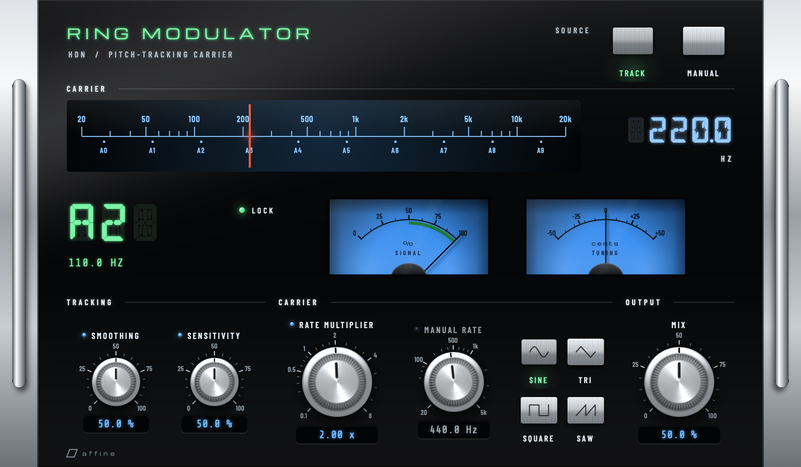

# HDN Ring Modulator

[](https://github.com/affinedsp/hdn-ringmod/actions/workflows/build.yml)

A pitch-tracking ring modulator audio plugin (VST3/AU/Standalone) built with JUCE 8.

<p align="center">
  
</p>

## What Is This?

This is just a ring modulator, with pitch tracking because there are none that are free. Traditional ring modulators use a fixed carrier frequency, which means the effect sounds different depending on what note you play -- often dissonant and hard to control.

This plugin adds **pitch tracking**. It listens to your input, detects the fundamental frequency in real time using the YIN pitch detection algorithm, and locks the modulator oscillator to that pitch. The result is a ring mod effect that tracks what you're playing, producing consistent harmonic relationships regardless of the note. The Rate Multiplier parameter lets you set the ratio between the detected pitch and the oscillator -- 1x gives you octave doubling, 2x gives you a fifth above that, and fractional values produce subharmonic content.

The plugin also has a conventional **Manual** mode where the oscillator runs at a fixed frequency, for traditional ring mod sounds.

Four oscillator waveforms are available (sine, triangle, square, saw), each producing a different harmonic character. Square and saw use PolyBLEP anti-aliasing to reduce digital artifacts.

## Interface

The panel reads top to bottom: the carrier, what the tracker hears, and the controls for each stage.

- **Carrier** dial: a lit 20 Hz to 20 kHz dial with the A of every octave marked. The pointer glides to the frequency the carrier oscillator is running at, published by the processor rather than estimated in the UI, and the readout beside it shows the exact value. The pointer parks at the left stop and the readout goes dark while the effect stays dry.
- **Input pitch** (green display): the detected note and frequency. **LOCK** lights only while the carrier is actually following the input. The display reads *LISTENING* while the tracker searches, *NO AUDIO* when the host is not processing, and *OFF* in Manual mode.
- **Signal** meter: how certain the detector is; its green zone starts at the **Sensitivity** threshold a detection must reach. **Tuning** meter: how far the input is from the nearest note, in cents.
- **Source** keys switch between Pitch Track and Manual. Controls that do not act in the current source keep working but show it: their activity lamp goes out and their readout dims.
- **Waveform** keys select the carrier shape.

Knobs have calibrated scales. Drag anywhere on a knob (up or right increases, Shift for fine), double-click or press Return to type an exact value, Alt/Option-click or Home to reset, and right-click for the parameter menu. The interface follows the shared [Affine design language](libs/affine-ui/DESIGN_LANGUAGE.md).

## Requirements

- CMake 3.25+
- C++20 compiler
- **macOS**: Xcode command line tools
- **Windows**: Visual Studio 2022 (MSVC)

## Building

Clone with submodules (JUCE is pinned as a git submodule):

```bash
git clone --recursive https://github.com/affinedsp/hdn-ringmod.git
cd hdn-ringmod
```

### macOS

Requires Xcode command line tools (`xcode-select --install`).

Using the default Makefile generator:

```bash
cmake -B build -DCMAKE_BUILD_TYPE=Release
cmake --build build --config Release
```

For faster builds with Ninja (`brew install ninja`):

```bash
cmake -B build -DCMAKE_BUILD_TYPE=Release -G Ninja
cmake --build build --config Release
```

To build a universal binary (arm64 + x86_64):

```bash
cmake -B build -DCMAKE_BUILD_TYPE=Release -G Ninja -DCMAKE_OSX_ARCHITECTURES="arm64;x86_64"
cmake --build build --config Release
```

The built plugins will be in:

- `build/HdnRingmod_artefacts/Release/VST3/HDN Ring Modulator.vst3`
- `build/HdnRingmod_artefacts/Release/AU/HDN Ring Modulator.component`
- `build/HdnRingmod_artefacts/Release/Standalone/HDN Ring Modulator.app`

To install, copy the `.vst3` to `~/Library/Audio/Plug-Ins/VST3/` or the `.component` to `~/Library/Audio/Plug-Ins/Components/`.

### Windows

Requires Visual Studio 2022 with the "Desktop development with C++" workload.

From a **Developer Command Prompt for VS 2022** (or using `vcvarsall.bat`):

```cmd
cmake -B build
cmake --build build --config Release
```

The built plugin will be in `build\HdnRingmod_artefacts\Release\VST3\HDN Ring Modulator.vst3`.

To install, copy the `.vst3` folder to `C:\Program Files\Common Files\VST3\`.

### Running Tests

```bash
cmake -B build -DCMAKE_BUILD_TYPE=Release -DHDN_BUILD_TESTS=ON
cmake --build build --config Release
ctest --test-dir build --build-config Release --output-on-failure
```

Set `HDN_UI_CAPTURE_DIR` to an absolute directory to have the tests render the editor in every display state (tracked, listening, manual, no audio) and at 125–200% scaling.

## Parameters

| Parameter       | Range                          | Default     | Description                              |
| --------------- | ------------------------------ | ----------- | ---------------------------------------- |
| Mix             | 0 - 100%                       | 50%         | Dry/wet blend                            |
| Rate Multiplier | 0.1 - 8.0x                     | 1.0x        | Multiplier applied to tracked pitch      |
| Manual Rate     | 20 - 5000 Hz                   | 440 Hz      | Fixed oscillator frequency (Manual mode) |
| Mode            | Pitch Track / Manual           | Pitch Track | Pitch source selection                   |
| Smoothing       | 0 - 100%                       | 50%         | Pitch tracking smoothing amount          |
| Sensitivity     | 0 - 100%                       | 50%         | Minimum confidence for accepting pitch updates; higher values require stronger detections |
| Waveform        | Sine / Triangle / Square / Saw | Sine        | Ring modulator oscillator shape          |

## How It Works

In **Pitch Track** mode, the plugin detects the pitch of the incoming audio using the YIN algorithm, then ring-modulates the signal with an oscillator locked to that pitch (multiplied by the Rate Multiplier). The effect stays dry only until the tracker has a valid pitch, then follows the tracked carrier directly.

The tracker uses short analysis windows for normal guitar notes and runs longer analyses for low or uncertain pitches, with slower background audits for octave errors. It supports fundamentals down to 20 Hz without imposing the low-frequency analysis rate on the common path. Acquisition can take roughly 110 ms near 20 Hz because one cycle alone is 50 ms.

In **Manual** mode, the oscillator runs at a fixed frequency set by the Manual Rate knob.

## License

GPLv3. See [LICENSE](LICENSE).
